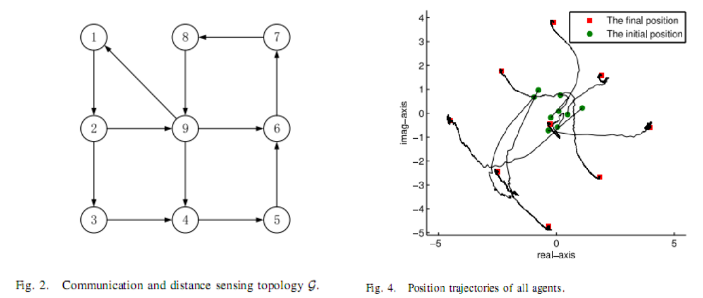
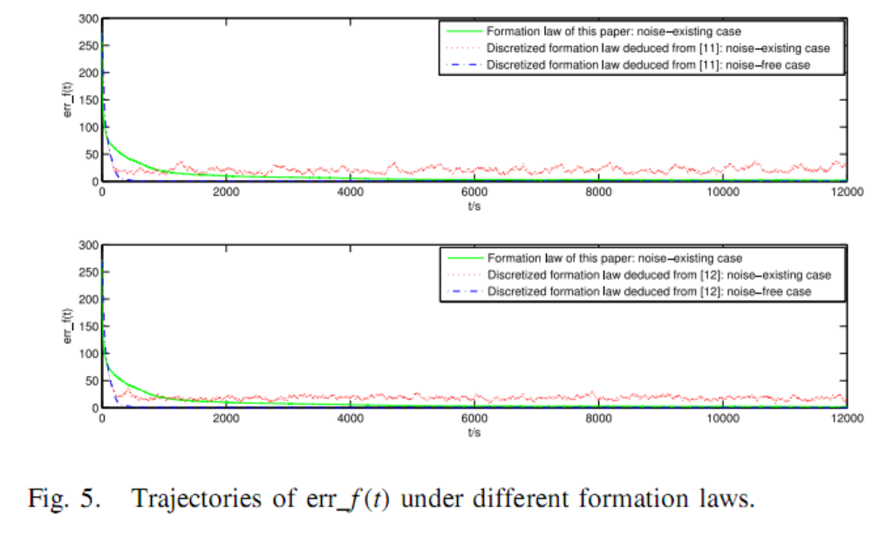

#### Distributed Formation Control: Asymptotic Stabilization Results Under Local Noisy Information
The matlab code for the simulation in [Distributed Formation Control: Asymptotic Stabilization Results Under Local Noisy Information](https://ieeexplore.ieee.org/document/8649831)

1. f_ali_1108 is the orientation alignment code;
2. f_o_0905 is the orientation estimation code;
3. f_g_0905 is the main formation code.

##### simulation
Some simulation results are shown below.

